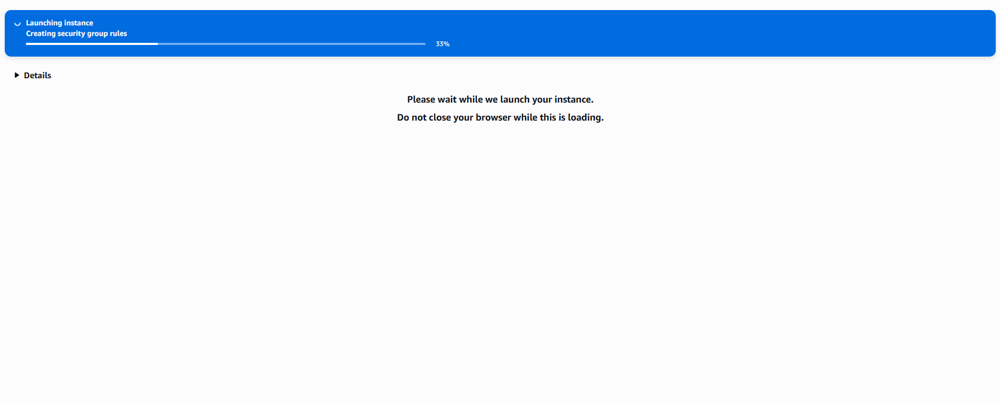
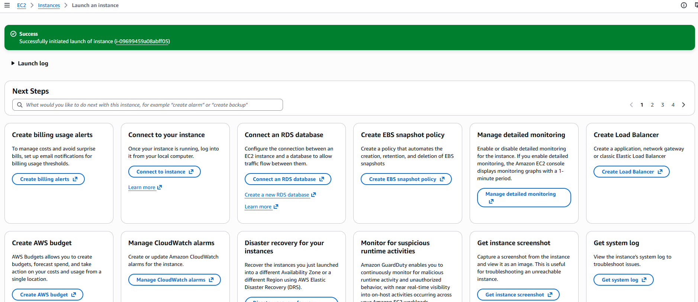
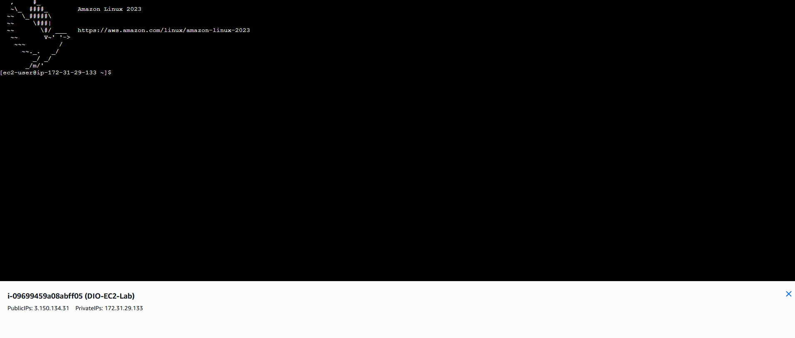

# ☁️ Laboratório Prático: Gerenciamento de Instâncias EC2 na AWS

## 📌 Sobre o Desafio
Este repositório documenta a conclusão do desafio prático de **Gerenciamento de Instâncias EC2 na AWS** realizado através da plataforma [DIO](https://www.dio.me/). O projeto consistiu no provisionamento, configuração de segurança e acesso remoto a um servidor em nuvem.

## 🎯 Objetivos Alcançados
- [x] Criação de chaves de segurança (Key Pairs).
- [x] Configuração de regras de Firewall (Security Groups).
- [x] Provisionamento de instância com Amazon Linux 2023.
- [x] Conexão remota via SSH/EC2 Instance Connect.

## 🛠️ Passo a Passo da Implementação

### 1. Criação do Par de Chaves (Key Pair)
Iniciei o processo criando a chave de segurança `chavee-dio` no formato `.pem`, essencial para garantir o acesso criptografado ao servidor.

### 2. Configurações de Rede e Segurança
Configurei o Security Group para permitir o tráfego SSH. Por boas práticas de segurança, restringi o acesso apenas ao meu endereço IP atual (`191.187.132.0/32`).

### 3. Lançamento da Instância
O processo de lançamento foi iniciado com sucesso, provisionando a infraestrutura necessária na nuvem da AWS.

### 4. Conexão e Acesso ao Terminal
Após a inicialização, utilizei o **EC2 Instance Connect** para acessar o terminal. Consegui interagir com o sistema operacional Amazon Linux 2023 diretamente pelo navegador.

## 💡 Insights e Aprendizados
1. **Segurança Restritiva:** Aprendi que restringir o acesso SSH apenas ao meu IP reduz drasticamente a superfície de ataque do servidor.
2. **Gerenciamento de Recursos:** Entendi a importância de acompanhar os logs de lançamento e confirmar o status da instância antes de tentar a conexão.
3. **Praticidade do Cloud:** A capacidade de subir um servidor funcional em minutos demonstra o poder da computação em nuvem para escalabilidade.

---
*Projeto realizado para a Formação AWS da DIO.*
